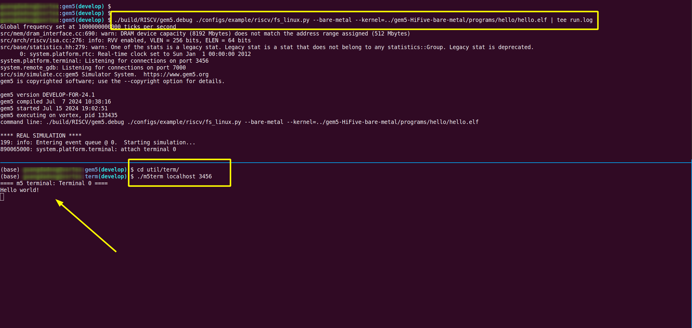

# gem5 HiFive platform Examples

## usage

### dir structure

```bahs
├── gem5
│   └── build
│       └── gem5.opt
└── gem5-HiFive-bare-metal
    └── programs/hello
        └── hello.elf
```

### build testcase

NOTE: set RISCV to riscvtoolchain

```bash
$ cd gem5-HiFive-bare-metal

$ module load riscv-toolchain/gcc-master  # set RISCV

$ export LIBFIVE_ROOT=$PWD/libfive

$ cd programs/hello
$ make
```

### gem5

```bash
$ cd gem5
$ scons -sQ -j$(nproc) build/RISCV/gem5.debug

$ ./build/RISCV/gem5.debug ./configs/example/riscv/fs_linux.py --bare-metal --kernel=../gem5-HiFive-bare-metal/programs/hello/hello.elf

# new ternimal/shell
$ cd util/term

$ make

$ ./m5term localhost 3456
```




## reference

1. [HiFive 1 Rev B Library and Examples](https://github.com/zyedidia/hifive)
1. [printf](https://github.com/mpaland/printf)
